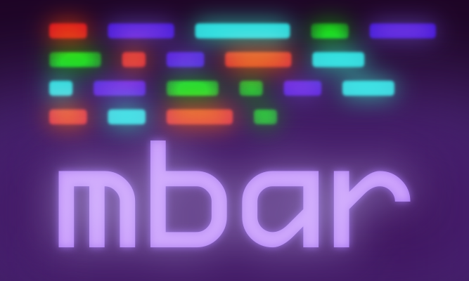

<div align="center">
  
  <h1><code>mbar.sh</code></h1>
  <h3>Minimal bash status bar library</h3>
  <h5>simple and declarative</h5>
  <br>
</div>

---

## Overview

mbar is a lightweight, zero-dependency status bar library for bash scripts.
It provides a clean, declarative interface for creating interactive status displays with keyboard handlers.

## Installation

Get a copy of the `mbar.sh` in your prefered method:


```bash
# curl GitHub API
curl -o mbar.sh -L \
  -H "Accept: application/vnd.github.raw+json" \
  https://api.github.com/repos/metaory/mbar.sh/contents/lib/mbar.sh

# curl raw
curl -o mbar.sh \
  https://raw.githubusercontent.com/metaory/mbar.sh/refs/heads/master/lib/mbar.sh

# wget raw
wget -O mbar.sh \
  https://raw.githubusercontent.com/metaory/mbar.sh/refs/heads/master/lib/mbar.sh

# clone the repository
git clone https://github.com/metaory/mbar.sh.git
```

```bash
# Source in your script
source mbar.sh
```

## Quick Start

Copy the `mbar.sh` to your project

```bash
#!/usr/bin/env bash
source mbar.sh

# Define keys
mbar_add_key "p" "pause"
mbar_add_key "q" "quit"

# Auto mode handlers
mbar_handler_p() {
  paused=$((paused ? 0 : 1))
}

mbar_handler_q() {
  exit 0
}

# Run status loop
for i in {1..10}; do
  mbar_loop "Processing item $i" "green"
  sleep 0.5
done
```

---

## API

### Core Functions

| Function                   | Description                             | Example                             |
| -------------------------- | --------------------------------------- | ----------------------------------- |
| `mbar_loop(msg, color)`    | Main status loop with keyboard handling | `mbar_loop "Processing..." "green"` |
| `mbar_show(msg, color)`    | Display status message                  | `mbar_show "Ready" "cyan"`          |
| `mbar_add_key(key, desc)`  | Register key with description           | `mbar_add_key "p" "pause"`          |
| `mbar_register(key, func)` | Register explicit handler               | `mbar_register "s" stop_func`       |

### Colors

- `green` - Success/ready
- `yellow` - Warning/paused  
- `red` - Error/stopped
- `cyan` - Info
- `magenta` - Highlight

---

## Usage Modes

### 1. Auto Mode (Convention-based)

Functions named `mbar_handler_<key>` are automatically discovered:

```bash
#!/usr/bin/env bash
source mbar.sh

mbar_add_key "p" "pause"
mbar_add_key "s" "stop"

mbar_handler_p() {
  paused=$((paused ? 0 : 1))
}

mbar_handler_s() {
  exit 0
}

while true; do
  mbar_loop "System running" "green"
  sleep 1
done
```

**Example**: [`examples/basic.sh`](examples/basic.sh)

### 2. Advanced Usage (Mixed Mode)

Combine auto and manual handlers with practical features:

```bash
#!/usr/bin/env bash
source mbar.sh

mbar_add_key "p" "pause"
mbar_add_key "s" "stop"
mbar_add_key "l" "list"
mbar_add_key "i" "info"

# Auto mode handlers
mbar_handler_p() {
  paused=$((paused ? 0 : 1))
}

mbar_handler_s() {
  exit 0
}

# Manual mode handlers
list_files() {
  echo "Files: $(ls | wc -l)"
}

show_info() {
  echo "Processed: $processed/$total"
}

mbar_register "l" list_files
mbar_register "i" show_info

for i in {1..10}; do
  mbar_loop "Processing item $i" "cyan"
  sleep 0.3
done
```

**Example**: [`examples/advanced.sh`](examples/advanced.sh)

---

## Requirements

- `Bash 4.0+` (for associative arrays)
- No external dependencies


> [!NOTE]
> for macOS users
>
> The library uses `#!/usr/bin/env bash` to automatically find the correct bash version.
> If you're using the system bash, install the latest bash:
>
> `brew install bash`

---

## License

[MIT](LICENSE)
